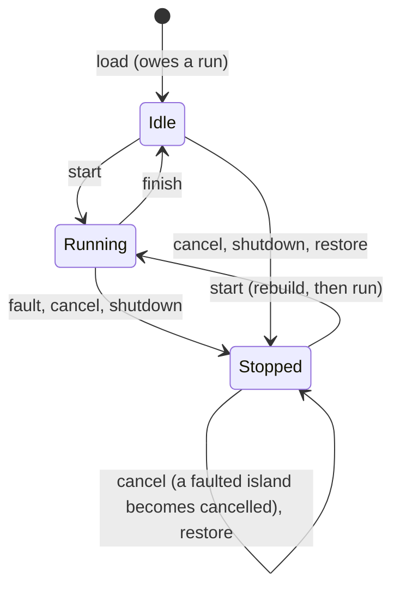

# witgraph

Flow graphs built from WebAssembly components.

Each node in a graph is a WASM component. Its WIT world is its contract: the
ports it exposes, their types, and how it runs. WIT is the source of truth:
contracts are always derived from it, never written by hand or stored in
graph files. Graphs are validated against those contracts and executed on
wasmtime using the component model's native `stream<T>` and `future<T>`.

## Crates

- **`witgraph-ir`** — the graph IR: port kinds, component contracts,
  the `GraphBuilder → Graph → CompiledGraph` typestate chain, validation
  diagnostics, topology (order, depth, stream islands). Payload types are
  `wasm_wave::value::Type`. Light on dependencies; `serde` is an on-by-default
  feature, and the crate builds without it.
- **`witgraph-wit`** — loads `.wit` sources with `wit-parser`, lowers
  component worlds into contracts, computes content hashes, and generates
  the editor-facing metadata catalog.
- **`witgraph-runtime`** — `RuntimeGraph`, the last typestate: a compiled
  graph loaded with component bytes and run on wasmtime.
- **`test-components`** (not published) — guest components used by the
  runtime tests.

## Building and testing

```sh
rustup target add wasm32-unknown-unknown
cargo test --workspace
cargo clippy --workspace --all-targets -- -D warnings
```

The workspace needs Rust 1.97 or newer. Building `test-components` builds
the guests listed in the `GUESTS` array of `test-fixtures/test-components/build.rs`
for `wasm32-unknown-unknown` (a nested `cargo build` per guest) and encodes
each as a component. A new directory under `guests/` is not picked up until
it is added to that list.

Toolchain pins, kept consistent with each other:

| Dependency | Version |
|---|---|
| wasmtime | 49.0.1 |
| wit-parser, wit-component, wasm-wave | 0.258 (the wasm-tools release wasmtime 49 is built on) |
| wit-bindgen (guests) | 0.61.0, with `async-spawn` |

## Components

A witgraph component is a WIT world that exports an interface named `node`.
The interface declares up to two records, `inputs` and `outputs` (at least
one), and exactly one function, `run`:

```wit
package demo:graph@0.1.0;

world sensor {
    import demo:caps/clock@0.1.0;          // a capability

    export node: interface {
        record reading { value: f64, timestamp: u64 }

        record inputs {
            sample-rate: option<u32>,      // optional Value input
        }
        record outputs {
            latest: reading,               // Value output
            samples: stream<reading>,      // Stream output
            threshold-crossed: stream<f64>,
        }

        run: async func(inputs: inputs) -> outputs;
    }
}
```

The example imports `demo:caps/clock`, so lowering it needs the `demo:caps`
package alongside it (for example under `deps/`).

### Ports

Each record field is a port. Its kind comes from the field's type, the same
way on both sides:

| Field type | Kind | Notes |
|---|---|---|
| `T` | Value | An input is read when `run` starts; an output is latched when `run` returns. |
| `option<T>` | Value | On `inputs` only: an optional port of payload `T`, which may stay unconnected. On `outputs` it is a Value whose payload is the option. |
| `stream<T>` | Stream | Ordered and back-pressured, with end-of-stream. A bare `stream` has no payload. |
| `future<T>` | Future | Resolves once. A bare `future` has no payload. |

`stream` and `future` may only appear at the top level of a field.

Payload types are resolved by wasm-wave, so a payload is anything WAVE can
represent. Rejected:
- resources and handles;
- `map` and `error-context`;
- nested `stream`/`future`;
- fixed-length lists, because the contract hash cannot observe their
  length.

A world fails to lower when it reaches (through its imports or exports) an
empty `record`, `flags` or `tuple`; a type, interface or function that
repeats a member name (ignoring case); more than 32 flags, 10,000 fields,
cases or tuple members, or 1,000 parameters; types nested more than 100
levels deep (aliases add no depth); or types, functions or a world whose
effective (expanded) size reaches 1,000,000. Types no world reaches are not
checked. wit-parser accepts all of these, but no component can contain
them. Lowering errors name the world as `package/world@version`.

A world may not import or export a named interface under a label
(`import primary: clock;`, `export node: contract;`, `export primary:
node;`), nor carry `@external-id`: components encode those with an
extension the runtime does not enable. Names within an imported or
exported interface may not differ only in letter case.

### `run`

`run` is either a `func` (sync) or an `async func`. Its signature must
match the records the node declares:
- it takes exactly `(inputs: inputs)` when an `inputs` record exists, and no
  parameters otherwise;
- it returns `outputs` when an `outputs` record exists, and nothing
  otherwise.

No other function may appear in `node`.

An async `run` may await its inputs before returning. For example, a
consumer can read a whole stream and then return a total as a Value output.
To produce a stream, return its reader from `run` and write from a spawned
task. The consumer's `run` cannot start until the producer's `run` has
returned the handle, so a producer that writes before returning deadlocks.

### Capabilities

A world's imports that the host must implement are its capabilities. Each
is named after what a component imports:
- **Named interfaces** that carry functions or declare resources count,
  under the interface's full id (`namespace:name/interface@version`). A
  resource needs a host implementation even when it has no methods.
- **Anonymous inline interfaces** that carry functions or declare resources
  count, under their import name (`config` for
  `import config: interface { ... }`). The host links either kind of
  interface as a `Linker` instance of that name.
- **Bare function imports** count, under their import name prefixed `func:`
  (`func:blink`). The host links `blink` at the `Linker`'s root.
- **Resources declared in the world itself** (`resource r;`) count, as
  `resource:r`, with their constructor, methods and statics as its items.
  The host links `r` and its functions at the `Linker`'s root.
- **Type-only imports** are structural and don't count. An interface the
  world imports only because `node` uses one of its types is still
  imported whole, so its functions count: the guest can call them.
- **The `witgraph:runtime` package** doesn't count. Only
  `witgraph:runtime/host@0.1.x` with `fatal: func(message: string)` may be
  imported from it; it is built in (below). Importing anything else from
  that package is a lowering error.

Each capability also records its *items*: every function (methods
included) and resource, with a canonical rendering of its signature
(`func()->u64`). Items are part of the contract and its hash. A resource in
a signature is named by its interface's id at its semver track (`@1`,
`@0.2`), so it stays the same resource across compatible versions only.

A world's capabilities are an upper bound on what a component built from it
imports: the component imports only the items its code uses.
`CompiledGraph::required_capabilities` aggregates the capabilities of every
component in a graph: one entry per link name, sorted; each item maps to
every signature it is imported with (more than one means components
disagree).

Contracts lowered from WIT and decoded from a component built from it agree
on ports and `run`; capabilities, and so content hashes, agree only if the
component imports everything the world declares.

### Guests in Rust

With wit-bindgen 0.61, a sync node is a plain function from inputs to outputs:

```rust
wit_bindgen::generate!({ path: "wit", world: "echo" });

use exports::node::{Guest, Inputs, Outputs};

struct Echo;

impl Guest for Echo {
    fn run(inputs: Inputs) -> Outputs {
        Outputs { out: inputs.in_.unwrap_or(0.0) }
    }
}

export!(Echo);
```

A world that imports another package (the runtime's `host` interface, or a
capability) keeps that package's WIT under `wit/deps/` and passes
`generate_all` so wit-bindgen generates the imported interfaces too:

```text
wit/
  world.wit
  deps/witgraph-runtime/witgraph-runtime.wit
```

```rust
wit_bindgen::generate!({ path: "wit", world: "busy-loop", generate_all });
```

An async node returns its stream reader and writes from a spawned task:

```rust
impl Guest for Producer {
    async fn run(inputs: Inputs) -> Outputs {
        let (mut tx, rx) = wit_stream::new::<u32>();
        wit_bindgen::spawn_local(async move {
            let mut i = 0u32;
            while inputs.burst_size.is_none_or(|n| i < n) {
                // `Some` back means the reader was dropped: stop.
                if tx.write_one(i).await.is_some() {
                    break;
                }
                i = i.wrapping_add(1);
            }
        });
        Outputs { items: rx }
    }
}
```

## Graphs

A `Graph` is plain, serializable data:
- metadata;
- a component table of `ComponentRef`s (`namespace:name/world@version` plus
  a content hash);
- nodes, each referencing a component, with optional resource claims;
- connections from output ports to input ports.

A graph never stores contracts. `Graph::compile(&contracts)` resolves the
component table through a `ContractSource` (a slice, `Vec`, or `HashMap` of
contracts, typically lowered from WIT by `witgraph-wit`). Compilation
collects every diagnostic rather than stopping at the first, and returns a
sealed `CompiledGraph` or the graph back with its diagnostics.

`witgraph_wit::load_components(path)` loads a `.wit` file, a directory, or a
wasm-encoded WIT package (dependencies under `deps/` may be either) and
lowers every component world in it into a contract; `load_lowered(path)`
also keeps each world's named types, for the editor catalog. A syntax
error, in the source or a dependency, is `LoadError::Parse`; resolution
errors carry their `file:line`.

A `CompiledGraph` exposes `graph()`, `contracts()`, `contract_for(node)`,
`warnings()`, `topological_order()`, `depth_map()`, `islands()`,
`island_of(node)`, `required_capabilities()`, and a resolved view of every
node (`node`, `nodes`: its contract and island) and connection
(`connections`: both ports, and whether it unwraps an option).
`topological_order()` takes the earliest-declared ready node at each step,
so it is stable; islands are ordered topologically, ties broken by their
first member's position.

### Contract resolution

- A component-table entry with a content hash must match a contract exactly.
  Compilation checks what the `ContractSource` returns: a contract with
  another package, world, version or (for a pinned entry) hash counts as
  not found.
- An entry without a hash resolves to the single contract with the same
  package, world and version, if exactly one exists (a hashless contract
  with exactly that id is one of them). Copies count once: one content
  hash, or hashless contracts equal but for docs; hashless contracts with
  one id that differ otherwise are `AmbiguousContract`, as are several
  revisions that fit. Large sources should use `ContractIndex`, which looks
  contracts up per world; custom sources implement
  `ContractSource::candidates`, and compilation applies the rule.
- A node's reference resolves against what each component-table entry
  resolved to, by package, world and version, narrowed by content hash when
  it carries one. A hashed reference never binds to a contract with another
  hash, or to a hashless contract, even through an unhashed entry. Entries that resolved to the same
  contract count once; if the reference still matches more than one, it is
  reported as ambiguous.

### Connection rules

- **Types match exactly.** Port kinds must be equal and payload types
  structurally equal: no coercion or widening. The one exception: a Value
  output of type `option<T>` may feed an optional input of payload `T`. The
  option passes straight through: `none` reads as an absent input,
  `some(x)` as `x`.
- **One writer per input.** Each input port has at most one incoming
  connection.
- **No stream or future fan-out.** A Stream or Future output connects to at
  most one input; use a tee node to fan out. Value outputs fan out freely.
- **Required inputs must be connected.** Every non-optional input needs a
  connection. Only Value inputs may be optional, and only inputs may be
  optional. A required input fed only by feedback connections gets a
  warning: its node cannot run until a first value is injected.
- **Cycles need a feedback edge.** Every cycle must cross at least one
  connection marked `feedback`, a unit-delay boundary that delivers the
  previous iteration's value.
  - Feedback connections must carry Value ports.
  - A feedback connection that is on no cycle, and does not keep two
    islands apart (see [Islands](#islands)), gets a warning.

### Component identity

A component is identified by `namespace:name/world@version` plus a sha-256
content hash of its lowered contract.

The hash covers the `run` kind, the sorted ports (direction, name, kind,
optionality and payload type) and the sorted capabilities with their items'
signatures. It does not cover the package, world, version, doc comments or
type names, so any two contracts with the same shape hash identically.
Capabilities are named by the full id of what the world imports, version
included: that is the dependency's identity, not the component's, so an
interface a world imports from its own package carries that package's name
and version into the hash. The canonical encoding starts with a
`witgraph-contract v3` line and uses its own type encoding, independent of
wasm-wave's display format.

### Editor catalog

`witgraph_wit::metadata::generate_catalog` produces a JSON-serializable
catalog (schema version 4) of components, ports, capabilities and named
types, for editors. Each entry's `id` is the pinned ref (`…@ver#hash`).

## Runtime

```rust
let compiled = graph.compile(&contracts)?;
let mut rt = RuntimeGraph::load(compiled, &wasm, RuntimeConfig::default(), Perf).await?;
rt.inject(&"scale".into(), &"factor".into(), Val::U32(10))?;
// One tick is one iteration of every feedback loop, so bound the ticks; a
// graph without feedback settles in one or two. `tick_until` bounds the
// time a tick may take.
for _ in 0..100 {
    let deadline = tokio::time::sleep(Duration::from_secs(1));
    match rt.tick_until(deadline).await {
        TickResult::Idle => break,
        TickResult::Progress | TickResult::StepLimitReached | TickResult::Interrupted => {}
        TickResult::Aborted { fault, .. } => return Err(fault.into()),
    }
    // Traps, exhausted fuel and limits fault an island without ending the
    // tick.
    for report in rt.take_faults() {
        eprintln!("{:?} faulted: {}", report.members, report.fault);
    }
}
let scaled = rt.read_output(&"scale".into(), &"out".into())?;
```

### Loading

`RuntimeGraph::load` takes the compiled graph, a map from `ComponentRef` to
component bytes, a `RuntimeConfig` and a `RuntimeMode`. A component's key
is the ref of its resolved contract, or a ref without a content hash, which
matches by package (version included) and world. Only components some node
instantiates need bytes.

For each component, loading:
1. decodes the WIT embedded in the bytes;
2. lowers it, which must yield exactly one `node` world;
3. checks it against the compiled contract: the same `run` kind and ports,
   and every capability item the bytes import declared by the contract with
   the same signature (fewer is fine: a component imports only what its
   code uses). An interface may be imported at a semver-compatible version
   of the declared one (wit-component merges such imports to the newest),
   the way wasmtime's linker matches it;
4. instantiates every node, island by island, finding `run` under the name
   the bytes export `node` as.

Bytes whose WIT cannot be decoded are a `BadComponent`, whatever goes wrong
inside the decoder. Before decoding, the bytes are validated, and every
type the component imports or exports must be one a node can have. An import merged to a newer semver-compatible version is
checked against the newest compatible declaration, which is what wasmtime's
linker resolves it to. Each node's component is linked once
(`InstancePre`); rebuilds reuse that.

Steps 1 to 3 and compiling are the slow part of a load, and run
synchronously. `PreparedComponent::new(engine, contract, bytes)` does them
on their own, so an embedder can run them off its executor
(`spawn_blocking`, say) and keep the result to load the same component
again without recompiling; `load_prepared` loads a graph from prepared
components. A prepared component belongs to the engine it was compiled on
(`RuntimeConfig::new_engine`), and to the contract it was checked against:
`load_prepared` rejects one prepared against another contract with the
same id (`ContractMismatch`). With `RuntimeConfig::engine` unset, it uses
the prepared components' engine. Either way, the loaded graph's `config()`
holds the engine it runs on.

`load` and `load_with_host` compile on the task that polls them, which
blocks that executor thread (often for seconds per component). On a shared
async executor, prepare components on a blocking thread and call
`load_prepared`.

Components that import capabilities load with `load_with_host`, which
takes the embedder's `Host`:
- `Host::link(node, contract, linker)` adds a node's capability imports to
  its wasmtime `Linker`. It runs once per node, after the built-in
  `witgraph:runtime/host` interface is added.
- `Host::island_data(members, state)` creates the data of an island's
  Store, when the island is built and every time it is rebuilt. The data
  type (`Host::Data`) is the embedder's, so capability state lives per
  island and hosts that need a particular data type (WASI, `bindgen!`) can
  be linked. It must keep the `HostState` it is handed (which enforces the
  island's memory and item limits) and hand it back through `IslandData`.
  An error fails the load (`Instantiation`) or the rebuild (`Restart`).

`load` is `load_with_host` with `NoCapabilities`.

Loading fails with a `RuntimeError`:

| Error | Cause |
|---|---|
| `MissingWasm` | No bytes for a component. |
| `BadComponent` | The bytes are not a valid component, import or export something no node can (a core module, a nested component, a function type), don't embed exactly one `node` world, or fail to compile. |
| `ContractMismatch` | The bytes have other ports or another `run` kind than the compiled contract, or import a capability item it does not declare with that signature. |
| `Instantiation` | A node failed to link or instantiate (a missing capability import, a trapping start function, an island over its memory limit), or `Host::island_data` failed. |
| `InvalidConfig` | A `RuntimeConfig` limit is zero, `memory_reservation` is too large to round to pages, components were prepared on another engine, or the engine cannot run a graph: no fuel metering, component-model async, concurrency, `map`, `error-context` or fixed-length-list support, epoch interruption on, or shared memories on. |

`RuntimeConfig` fields and defaults:

| Field | Default | Meaning |
|---|---|---|
| `max_steps_per_tick` | 10,000 | Most generations one tick may start: a bound on one tick's work, not a loop detector. |
| `yield_interval` | 100,000 | Fuel an island burns before yielding to the executor (at least 1). |
| `fuel_per_run` | `None` | Fuel budget reset before every `run`; `None` is effectively unlimited. |
| `max_island_memory` | 1 GiB | Linear memory and tables an island's instances may hold in total; `None` is unlimited. |
| `hostcall_fuel` | 128 MiB | Host memory the values copied out of a guest in one call may take (each value element costs about 48 bytes). |
| `memory_reservation` | `None` | Address space each linear memory reserves up front, in whole pages (`0` reserves none); `None` keeps wasmtime's default. Only used when the runtime makes the engine. |
| `engine` | `None` | The wasmtime engine to use: one from `RuntimeConfig::new_engine`, or another graph's `engine()`, so graphs share it. `None` uses the prepared components' engine, or makes one. |

A loaded graph also exposes `node_state(node)` (`UnknownNode` for a node
not in the graph), `take_faults()`, `input_type(node, port)` and
`output_type(node, port)` (a Value port's wasmtime type), `compiled()`,
`config()`, `mode()`, `engine()`, `host()` and `host_mut()`. The crate
re-exports `wasmtime` and `witgraph_ir`, so an embedder links against
exactly the versions it was built with.

### Islands

Nodes joined by stream or future connections form an **island**
(`CompiledGraph::islands`). Every member of an island is instantiated in one
wasmtime Store, so stream and future handles pass directly from a
producer's `run` result into the consumer's `run` arguments. A node with no
stream or future connection is an island of its own.

Islands form a DAG. When a non-feedback path leaves an island and re-enters
it through other islands (a stream island whose Value output, through a
relay, feeds one of its own members, say), compilation merges every island
on that cycle into one and warns (`MergedIsland`). Inside the merged island
the path runs in dependency order within one generation. Marking a
connection on the path `feedback` keeps the islands apart instead. Every
member of a merged island runs in each of its generations, whichever input
changed. `CompiledGraph::islands` lists islands in a topological order of
that DAG.

The host only handles Values: it latches them and delivers them between
islands. A stream or future output with no consumer is closed as soon as its
`run` returns, so the guest's writes fail instead of blocking.

Islands have limits, because wasmtime isolates and schedules per Store:
- **Shared fate.** A trap in any member faults the whole island; a trap
  poisons the Store.
- **No interleaving within an island.** A busy member starves its siblings.
  Separate islands do interleave, through `yield_interval`.
- **The host never sees stream or future items.** It cannot read, trace,
  copy or tee them.

### Generations and ticks

An island runs in **generations**. A generation calls each member's `run`
once:
- in dependency order, with independent members called concurrently;
- it finishes when every `run` has returned **and** no guest task is left
  in the Store (such as a stream writer spawned before returning).

Value state and when an island runs:
- **Latched values.** The host keeps one latched value per Value input port
  (written by connections and by `inject`) and one per Value output port
  (latched when its `run` returns). An island's Value outputs reach other
  islands as soon as each `run` returns.
- **Owed generations.** Each island keeps a queue of the generations it
  owes, separate from its lifecycle phase. A newly loaded island owes one
  run. When one of its external Value inputs changes, it owes a run on the
  latched inputs, whatever phase it is in. Change is decided by value
  equality, so writing an equal value is not a change, and any number of
  changes before the next start owe a single run.
- **When an island starts.** All of these must hold:
  - it owes a generation and is not already running;
  - for a run on the latched inputs, every required external Value input has
    a value (a restored replay brings its own inputs);
  - its resource claims fit;
  - nothing upstream can still change its inputs. Upstream are the nodes of
    other islands that reach one of its members over non-feedback
    connections. In a running island, a member holds back what it reaches
    while its `run` has not returned, or while something upstream of it can
    still change. An idle or stopped island runs all its members together,
    so all of them hold back what they reach while the island could start,
    or while something upstream of it can still change. A running island
    that owes another generation holds back nothing more: it may never
    finish. So a Value latched mid-generation, by a streaming island that
    never finishes, say, still reaches everything downstream of it.

  Islands are considered in the compiled graph's island order, which is
  topological, pass after pass until nothing more can start. A stopped
  island's generation first rebuilds it in a fresh Store; the rebuild runs
  inside the generation, beside every other island.
- **No pre-emption.** A generation in flight is never pre-empted. If inputs
  change while it runs, the island owes another run and starts again
  afterwards, with fresh stream and future handles.

`tick()` drives this until nothing is in flight and nothing can start, then
latches every feedback connection: one tick is one iteration of every loop.
A tick that returns `StepLimitReached` or `Aborted` latches nothing; a later
tick finishes the iteration. `tick_until(stop)` is `tick()` that ends early,
with `Interrupted`, when `stop` completes (a timer, say). An interrupted
tick, or a dropped one, latches each buffered feedback value whose
iteration is over: its target island has settled (it is not running,
cannot start, and nothing upstream of it can), and so has every feedback
source into that island. So feedback loops advance one iteration per tick
even beside an island that never finishes.

A host write that changes an input wins over older feedback: it drops any
feedback value buffered for that input, and a feedback value produced by a
generation that started before the write is discarded. A write that
changes nothing (injecting the current value, or clearing an input that
has none) is not a host write and leaves buffered feedback alone. A tick
returns:

| Result | Meaning |
|---|---|
| `Progress` | A generation started or finished, or a feedback value changed. Tick again. |
| `Idle` | Nothing can make progress: nothing ran, and nothing that is waiting can start. |
| `Interrupted` | `tick_until`'s `stop` completed first. In-flight generations carry on next tick. |
| `StepLimitReached` | `max_steps_per_tick` generations (a stopped island's rebuild included) started before quiescence. |
| `Aborted { node, fault }` | A node called `fatal`. |

In-flight generations live in the `RuntimeGraph`, not in the tick's future.
So:
- **Dropping a tick is safe.** Abandoning it on a timeout loses nothing; the
  next tick resumes. A `run` that returned during the dropped tick has its
  outputs latched and delivered by the next call that takes `&mut self`
  (`tick`, `inject`, `clear_input`, `rerun`, `cancel`, `shutdown` or
  `restore`), before that call does anything else.
- **Driving the graph.** A graph with feedback ticks forever by design, so
  a driver bounds the number of ticks (or the time), not the steps.
- **An endless generation never lets the tick finish.** Examples are an
  infinite stream, or a source that never closes. Bound the tick with
  `tick_until`, or `cancel` the node.

### Inputs and outputs

- **`inject(node, port, val)`** writes a Value input. It checks the value's
  type structurally against the port (for an optional port, against its
  inner type). An unknown node (`UnknownNode`), a non-Value port
  (`NotAValuePort`), a port a non-feedback connection writes
  (`ConnectedInput`: an input has one writer) or a wrong type (`ValueType`)
  is an error. Required inputs fed only by a feedback connection need an
  initial `inject`.
  An unconnected optional input reads as `none` until a value is injected.
  Values are kept in one canonical form (flags in declaration order), so a
  value equal up to flag order is not a change. Floats compare as wasmtime
  compares them: every NaN equals every other, and `0.0` differs from
  `-0.0`.
- **`inject_wave(node, port, text)`** injects a value written as WAVE text,
  parsed against the port's type; record fields, cases and flags the type
  does not have are rejected (`ValueType`).
- **`clear_input(node, port)`** forgets an injected value: an optional input
  reads as `none` again. It takes the same ports as `inject`.
- **`rerun(node)`** makes the node's island owe a run on its latched inputs,
  as an input change would. It is how an island whose inputs the host
  cannot change (a capability-driven source, say) runs again after a fault,
  cancel or shutdown.
- **`read_output(node, port)`** returns a Value output's latched value, or
  `None` before the node has run. An unknown node (`UnknownNode`) or a port
  that is not a Value output (`NotAValuePort`) is an error.

`Val` is wasmtime's component value type, re-exported.

### Lifecycle

The island, not the node, carries the lifecycle, because every member
starts, finishes, faults and is cancelled together. Internally it is a
typestate with three phases, each owning only its own data:
- **Idle** owns the island's Store.
- **Running** owns the generation, which owns the Store.
- **Stopped** owns no Store, only why it stopped: a fault, a cancel, or
  shutdown.



A node's phase is a projection of its island's state. `node_state(node)`
returns a `NodeState` view with `phase()`, `fault_cause()`, `culprit()`,
`id()` and `shape()`. `culprit()` names the member that caused its island's
fault when it is known: the one that called `fatal` or failed to rebuild,
or the island's only member. In a larger island a trap cannot be pinned on
one member (one that returned may still run a task it spawned), so it has
none.

| Island | Node phase |
|---|---|
| Idle, not run since it was loaded | `Pending` |
| Stopped by a restore | `Pending` |
| Running | `Running` |
| Idle, after a finished generation | `Idle` |
| Stopped by a fault | `Faulted` |
| Stopped by cancel or shutdown | `Cancelled` |

`Running` covers the whole generation, including guest work that continues
after the node's own `run` returned. Each node-phase change is reported as a
`PhaseTransition` trace event for every member.

### Faults

A fault stops the island and faults every member with a `NodeFault`:

| Fault | Cause |
|---|---|
| `WasmTrap` | A trap in any member, spawned tasks included, or an island over its instance, memory or table count. |
| `MemoryLimit` | Growing a memory or table would take the island past `max_island_memory`. |
| `HostcallFuelExhausted` | One call copied more out of a guest than `hostcall_fuel` allows. |
| `FuelExhausted` | The island burned its `fuel_per_run` budget. |
| `Fatal` | A member called `fatal` (in `run`, or in a start function while the island was rebuilt); the tick returns `Aborted`. |
| `Restart` | Rebuilding the stopped island failed: instantiating a member, or `Host::island_data`. The rebuild runs at the start of the island's generation. |

Only `fatal` ends a tick. Every fault is also recorded for `take_faults()`,
which returns the latest fault of each island that faulted since the last
call (members, culprit and fault).

Owed work survives a fault, a failed rebuild included: the generation that
faulted is consumed, but if an input changed while it ran, the island is
rebuilt and runs again; otherwise it waits for its next input change or
`rerun`.

### Cancellation and shutdown

- **`cancel(node)`** cancels the node's whole island. It drops any in-flight
  generation and the Store, releases its resource claims, forgets the
  island's owed work (feedback values buffered for its members included),
  and marks every member `Cancelled`. Islands it was holding back may start
  on the next tick.
  A faulted island becomes cancelled too. Cancelling a cancelled island
  forgets the work it was owed since, and reports nothing.
- **`shutdown()`** does the same for every live island, and forgets
  every buffered feedback value. A faulted island keeps its fault, but its
  owed work is forgotten.

A cancelled or shut-down island is rebuilt on its next input change or
`rerun`.

Inside an island, cancellation is native to the component model:
- a consumer that drops its reader makes the producer's writes fail;
- a producer that drops its writer gives the consumer end-of-stream.

### `fatal`

Every host provides `witgraph:runtime/host`:

```wit
interface host {
    fatal: func(message: string);
}
```

Calling `fatal` faults the caller's island with `NodeFault::Fatal`, and the
current tick returns `Aborted`.

### Resources

Nodes may claim fractions (in `(0, 1]`) of named resources, each with
capacity 1.0.
- **Claims are per island.** An island's claim is the sum of its members'
  claims.
- **Lifetime.** A claim is held from generation start until the generation
  finishes, faults or is cancelled.
- **Admission.** The scheduler defers an island whose claims would exceed
  capacity.
- **Compile check.** Compilation rejects an island whose members' claims
  on one resource sum past 1.0 (`IslandOverclaims`).

### Sandboxing

Every island Store meters fuel:
- **`yield_interval`** (default 100,000): the island yields to the executor
  after burning this much fuel, so a busy island cannot starve other
  islands.
- **`fuel_per_run`** (default `None`, effectively unlimited): before every
  `run` call, the island's fuel is reset to this budget. An island that
  burns it before its next `run` starts faults with
  `NodeFault::FuelExhausted`. Instantiation (a guest's `_initialize`) does
  not spend it.

The budget is shared by everything running in the island, spawned tasks
included. An endless streaming generation therefore exhausts any finite
budget eventually. Give endless islands `None`, or a budget sized for how
long they should live.

Every island Store is also limited:
- **`max_island_memory`** (default 1 GiB): the linear memory and tables
  (8 bytes per element) all of the island's instances may hold together.
  Growing past it faults the island (`MemoryLimit`), and an island that
  needs more than it at instantiation fails to load. A growth past a
  memory's own declared maximum is refused without being charged. Nothing
  granted is refunded (wasmtime reports growth failures it never asked
  about, so a refund could be forged).
- **Item counts:** an island Store may hold at most 64 core instances, 16
  memories and 16 tables per member. Every memory reserves address space
  whatever its size, so a crafted component cannot exhaust the process's
  address space with empty memories.
- **`hostcall_fuel`** (default 128 MiB): wasmtime's per-call budget for the
  values lifted *out of* a guest, roughly bytes of host memory. It bounds
  what a `run` returns, the arguments a guest passes to an imported
  function (a capability, or `fatal`), and stream and future items copied
  between members of an island. Going over faults the island
  (`HostcallFuelExhausted`). Values passed into a guest are not charged. It
  bounds each lifted value, not the host's copies: a Value output is copied
  once for the host and once for each in-island consumer, and each
  generation start copies its external inputs.
- **`memory_reservation`** (default `None`): the address space each linear
  memory reserves up front. Wasmtime's default (4 GiB plus guards on 64-bit
  hosts) lets compiled code skip bounds checks, but a process then holds
  at most about 32k memories. A smaller reservation holds more, at the cost
  of bounds checks. Only used when the runtime makes the engine.

### Snapshots

`snapshot()` captures the host-visible state at any time, mid-generation
included. It captures:
- latched Value inputs and outputs, and pending feedback values, as WAVE
  text;
- every node's phase;
- for each island with work outstanding (named by its sorted members), the
  external inputs its in-flight generation started with, whether another
  generation is queued, and which of its feedback connections a newer host
  write overrides (`stale_feedback`);
- the component ref (id and content hash) of every node, and the graph's
  connections;
- a `quiescent` flag: no generation in flight (a restored replay not
  started yet is listed under its island, but is not in flight). It and
  the phases are informational: `restore` does not apply them.

`Snapshot` is a serde type.

`restore(&snapshot)` puts that state back:
- **Preconditions.** No island may be running (`NotQuiescent`): the graph
  is freshly loaded, shut down, or every running island was just
  cancelled. It must have exactly the snapshot's nodes (each with a phase),
  components and connections. Islands are matched by their set of members,
  in any order. An island that does not exist or is listed twice, a replay
  naming a node outside its island, a feedback value for a connection that
  is not a feedback connection, or stale feedback that is not a feedback
  connection out of its island (or listed without a replay) is a
  `SnapshotMismatch`.
- **Validation.** Every value is parsed against its port type; record
  fields, cases and flags the type does not have are rejected. A replay
  must bring every required external Value input of its island and nothing
  else. Either failure is a `SnapshotValue`. On any error, nothing
  changes.
- **Owed work.** Each island owes exactly what the snapshot recorded: a
  replay of the generation that was in flight, then a run on the latched
  inputs if one was queued. Islands with nothing outstanding owe nothing,
  even on a freshly loaded graph.
- **Guest state.** Every island drops its Store (its nodes read as
  `Pending`), so no guest state outlives a restore: each island is rebuilt
  when it next runs.
- **Replay.** A replay re-runs the generation from its start, with the
  inputs it started with, in a fresh Store. It runs before
  its own island's queued run, but like any start it waits for what is
  upstream of the island and for resources, so other islands may start
  first. A host write after the restore wins over what it feeds back to
  that input, and so does one the snapshot recorded as newer than the
  original generation (`stale_feedback`).

Snapshots do not store stream or future contents. Restoring re-runs any
generation that was in flight, which recreates its streams from the recorded
inputs; the result matches the original only if the guests are
deterministic. Guest memory, including suspended tasks, cannot be read out
of wasmtime and is not captured. A replayed source that pulls from a
capability pulls again. Node phases are recorded for debugging but not
restored.

### Limits

- **Progress happens inside `tick()`.** Every island is driven by the task
  awaiting the current tick; between ticks, nothing runs.
- **One fuel budget.** `fuel_per_run` applies to every island alike.
- **Merged islands share a fate.** Islands merged to keep the island graph
  a DAG share one Store, fault together, do not interleave, and sum their
  resource claims (an island over 1.0 fails to load).
- **One task at a time.** A `RuntimeGraph` is `Send` but not `Sync`: every
  call takes it by `&mut` (or `&` for reads) from the task that owns it.

### Instrumentation

`RuntimeGraph<M, H>` is generic over a `RuntimeMode` (and the `Host`):
- **`Perf`** has empty callbacks.
- **`Trace`** records `TraceEvent`s, read back with `Trace::trace()` (or
  drained with `Trace::take_trace()`, so a long run's trace stays bounded):
  `GenerationStarted`, `RunStarted`, `RunReturned`, `GenerationFinished`,
  `GenerationStopped` (faulted, cancelled, or dropped with the graph),
  `PhaseTransition`,
  `Fault`, `Cancelled` and `Restarted`.
