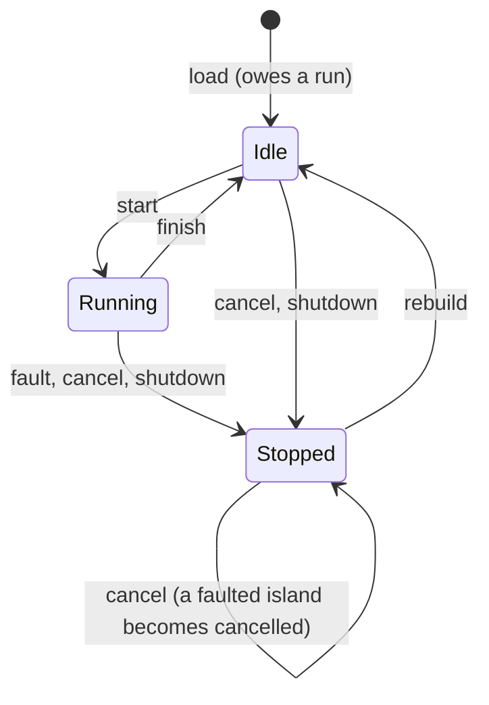

# witgraph

Flow graphs built from WebAssembly components.

Each node in a graph is a WASM component. Its WIT world is its contract: the
ports it exposes, their types, and how it runs. WIT is the source of truth:
contracts are always derived from it, never written by hand or stored in
graph files. Graphs are validated against those contracts and executed on
wasmtime using the component model's native `stream<T>` and `future<T>`.

## Crates

- **`witgraph-ir`** — the graph IR: port kinds, component contracts,
  the `GraphBuilder → Graph → CompiledGraph` typestate chain, validation
  diagnostics, topology (order, depth, stream islands). Payload types are
  `wasm_wave::value::Type`. Light on dependencies; `serde` is an on-by-default
  feature, and the crate builds without it.
- **`witgraph-wit`** — loads `.wit` sources with `wit-parser`, lowers
  component worlds into contracts, computes content hashes, and generates
  the editor-facing metadata catalog.
- **`witgraph-runtime`** — `RuntimeGraph`, the last typestate: a compiled
  graph loaded with component bytes and run on wasmtime.
- **`test-components`** (not published) — guest components used by the
  runtime tests.

## Building and testing

```sh
rustup target add wasm32-unknown-unknown
cargo test --workspace
cargo clippy --workspace --all-targets -- -D warnings
```

The workspace needs Rust 1.97 or newer. Building `test-components` builds
the guests listed in the `GUESTS` array of `test-fixtures/test-components/build.rs`
for `wasm32-unknown-unknown` (a nested `cargo build` per guest) and encodes
each as a component. A new directory under `guests/` is not picked up until
it is added to that list.

Toolchain pins, kept consistent with each other:

| Dependency | Version |
|---|---|
| wasmtime | 49.0.1 |
| wit-parser, wit-component, wasm-wave | 0.258 (the wasm-tools release wasmtime 49 is built on) |
| wit-bindgen (guests) | 0.61.0, with `async-spawn` |

## Components

A witgraph component is a WIT world that exports an interface named `node`.
The interface declares up to two records, `inputs` and `outputs` (at least
one), and exactly one function, `run`:

```wit
package demo:graph@0.1.0;

world sensor {
    import demo:caps/clock@0.1.0;          // a capability

    export node: interface {
        record reading { value: f64, timestamp: u64 }

        record inputs {
            sample-rate: option<u32>,      // optional Value input
        }
        record outputs {
            latest: reading,               // Value output
            samples: stream<reading>,      // Stream output
            threshold-crossed: stream<f64>,
        }

        run: async func(inputs: inputs) -> outputs;
    }
}
```

The example imports `demo:caps/clock`, so lowering it needs the `demo:caps`
package alongside it (for example under `deps/`).

### Ports

Each record field is a port. Its kind comes from the field's type, the same
way on both sides:

| Field type | Kind | Notes |
|---|---|---|
| `T` | Value | An input is read when `run` starts; an output is latched when `run` returns. |
| `option<T>` | Value | On `inputs` only: an optional port of payload `T`, which may stay unconnected. On `outputs` it is a Value whose payload is the option. |
| `stream<T>` | Stream | Ordered and back-pressured, with end-of-stream. A bare `stream` has no payload. |
| `future<T>` | Future | Resolves once. A bare `future` has no payload. |

`stream` and `future` may only appear at the top level of a field.

Payload types are resolved by wasm-wave, so a payload is anything WAVE can
represent. Rejected:
- resources and handles;
- `map` and `error-context`;
- nested `stream`/`future`;
- fixed-length lists, because the contract hash cannot observe their
  length.

An empty `record`, `flags` or `tuple` anywhere in the WIT source fails every
world in it that exports `node` (other worlds are skipped as usual).
wit-parser accepts these types, but no component can contain them.

### `run`

`run` is either a `func` (sync) or an `async func`. Its signature must
match the records the node declares:
- it takes exactly `(inputs: inputs)` when an `inputs` record exists, and no
  parameters otherwise;
- it returns `outputs` when an `outputs` record exists, and nothing
  otherwise.

No other function may appear in `node`.

An async `run` may await its inputs before returning. For example, a
consumer can read a whole stream and then return a total as a Value output.
To produce a stream, return its reader from `run` and write from a spawned
task. The consumer's `run` cannot start until the producer's `run` has
returned the handle, so a producer that writes before returning deadlocks.

### Capabilities

A world's imports are its capabilities:
- **Named interfaces** that carry functions count, under the interface's full
  id (`namespace:name/interface@version`).
- **Anonymous inline interfaces** that carry functions count, scoped to the
  importing world (`namespace:name/world.import-name@version`).
- **Bare function imports** count, prefixed `func:`.
- **Type-only imports** are structural and don't count.
- **The `witgraph:runtime` package** doesn't count: any interface from it is
  treated as built in. Hosts provide only `witgraph:runtime/host@0.1.0`
  (below); a component importing anything else from that package fails to
  instantiate.

`CompiledGraph::required_capabilities` aggregates the capabilities of every
component in a graph.

### Guests in Rust

With wit-bindgen 0.61, a sync node is a plain function from inputs to outputs:

```rust
wit_bindgen::generate!({ path: "wit", world: "echo" });

use exports::node::{Guest, Inputs, Outputs};

struct Echo;

impl Guest for Echo {
    fn run(inputs: Inputs) -> Outputs {
        Outputs { out: inputs.in_.unwrap_or(0.0) }
    }
}

export!(Echo);
```

A world that imports another package (the runtime's `host` interface, or a
capability) keeps that package's WIT under `wit/deps/` and passes
`generate_all` so wit-bindgen generates the imported interfaces too:

```text
wit/
  world.wit
  deps/witgraph-runtime/witgraph-runtime.wit
```

```rust
wit_bindgen::generate!({ path: "wit", world: "busy-loop", generate_all });
```

An async node returns its stream reader and writes from a spawned task:

```rust
impl Guest for Producer {
    async fn run(inputs: Inputs) -> Outputs {
        let (mut tx, rx) = wit_stream::new::<u32>();
        wit_bindgen::spawn_local(async move {
            let mut i = 0u32;
            while inputs.burst_size.is_none_or(|n| i < n) {
                // `Some` back means the reader was dropped: stop.
                if tx.write_one(i).await.is_some() {
                    break;
                }
                i = i.wrapping_add(1);
            }
        });
        Outputs { items: rx }
    }
}
```

## Graphs

A `Graph` is plain, serializable data:
- metadata;
- a component table of `ComponentRef`s (`namespace:name/world@version` plus
  a content hash);
- nodes, each referencing a component, with optional resource claims;
- connections from output ports to input ports.

A graph never stores contracts. `Graph::compile(&contracts)` resolves the
component table through a `ContractSource` (a slice, `Vec`, or `HashMap` of
contracts, typically lowered from WIT by `witgraph-wit`). Compilation
collects every diagnostic rather than stopping at the first, and returns a
sealed `CompiledGraph` or the graph back with its diagnostics.

`witgraph_wit::load_components(path)` loads a `.wit` file or directory and
lowers every component world in it into a contract; `load_lowered(path)`
also keeps each world's named types, for the editor catalog.

A `CompiledGraph` exposes `graph()`, `contracts()`, `contract_for(node)`,
`warnings()`, `topological_order()`, `depth_map()`, `islands()`,
`island_of(node)` and `required_capabilities()`.

### Contract resolution

- A component-table entry with a content hash must match a contract exactly.
- An entry without a hash resolves to the single contract with the same
  package, world and version, if exactly one exists.
- A node's reference resolves against the component table by package, world
  and version, narrowed by content hash when it carries one. If it still
  matches more than one entry, it is reported as ambiguous.

### Connection rules

- **Types match exactly.** Port kinds must be equal and payload types
  structurally equal: no coercion, widening, or option lifting.
- **One writer per input.** Each input port has at most one incoming
  connection.
- **No stream or future fan-out.** A Stream or Future output connects to at
  most one input; use a tee node to fan out. Value outputs fan out freely.
- **Required inputs must be connected.** Every non-optional input needs a
  connection. Only Value inputs may be optional, and only inputs may be
  optional.
- **Cycles need a feedback edge.** Every cycle must cross at least one
  connection marked `feedback`, a unit-delay boundary that delivers the
  previous iteration's value.
  - Feedback connections must carry Value ports.
  - A feedback connection that is on no cycle gets a warning.

### Component identity

A component is identified by `namespace:name/world@version` plus a sha-256
content hash of its lowered contract.

The hash covers the `run` kind, the sorted ports (direction, name, kind,
optionality and payload type) and the sorted capabilities. It does not cover
the package, world, version, doc comments or type names, so any two
contracts with the same shape hash identically. The canonical encoding
starts with a `witgraph-contract v2` line and uses its own type encoding,
independent of wasm-wave's display format.

### Editor catalog

`witgraph_wit::metadata::generate_catalog` produces a JSON-serializable
catalog (schema version 2) of components, ports, capabilities and named
types, for editors.

## Runtime

```rust
let compiled = graph.compile(&contracts)?;
let mut rt = RuntimeGraph::load(compiled, &wasm, RuntimeConfig::default(), Release).await?;
rt.inject("sensor".into(), "sample-rate".into(), Val::U32(10))?;
while let TickResult::Progress = rt.tick().await {}
let latest = rt.read_output(&"sensor".into(), &"latest".into());
```

### Loading

`RuntimeGraph::load` takes the compiled graph, a map from `ComponentRef` to
component bytes, a `RuntimeConfig` and a `RuntimeMode`. A component's key
is the ref of its resolved contract, or a ref without a content hash, which
matches by package (version included) and world.

For each component, loading:
1. decodes the WIT embedded in the bytes;
2. lowers it, which must yield exactly one `node` world;
3. rejects bytes whose contract hash differs from the compiled contract;
4. instantiates every node, island by island.

`load_with_linker` also takes a callback that adds capability imports to
each node's wasmtime `Linker`. It runs once per node, after the built-in
`witgraph:runtime/host` interface is added.

Loading fails with a `RuntimeError`:

| Error | Cause |
|---|---|
| `MissingWasm` | No bytes for a component. |
| `BadComponent` | The bytes are not a component, or don't embed exactly one `node` world. |
| `ContractMismatch` | The embedded contract hashes differently from the compiled one. |
| `Instantiation` | A node failed to instantiate (for example, a missing capability import). |
| `InvalidConfig` | A `RuntimeConfig` field is zero, or an island's summed claims on a resource exceed 1.0. |

`RuntimeConfig` fields and defaults:

| Field | Default | Meaning |
|---|---|---|
| `max_steps_per_tick` | 10,000 | Most generations one tick may start. |
| `yield_interval` | `Some(100_000)` | Fuel an island burns before yielding; `None` disables yielding. |
| `fuel_per_run` | `None` | Fuel budget reset before every `run`; `None` is effectively unlimited. |

A loaded graph also exposes `node_state(node)`, `compiled()`, `config()`,
`mode()` and `engine()`.

### Islands

Nodes joined by stream or future connections form an **island**
(`CompiledGraph::islands`). Every member of an island is instantiated in one
wasmtime Store, so stream and future handles pass directly from a
producer's `run` result into the consumer's `run` arguments. A node with no
stream or future connection is an island of its own.

The host only handles Values: it latches them and delivers them between
islands. A stream or future output with no consumer is closed as soon as its
`run` returns, so the guest's writes fail instead of blocking.

Islands have limits, because wasmtime isolates and schedules per Store:
- **Shared fate.** A trap in any member faults the whole island; a trap
  poisons the Store.
- **No interleaving within an island.** A busy member starves its siblings.
  Separate islands do interleave, through `yield_interval`.
- **The host never sees stream or future items.** It cannot read, trace,
  copy or tee them.

### Generations and ticks

An island runs in **generations**. A generation calls each member's `run`
once:
- in dependency order, with independent members called concurrently;
- it finishes when every `run` has returned **and** no guest task is left
  in the Store (such as a stream writer spawned before returning).

Value state and when an island runs:
- **Latched values.** The host keeps one latched value per Value input port
  (written by connections and by `inject`) and one per Value output port
  (latched when its `run` returns). An island's Value outputs reach other
  islands as soon as each `run` returns.
- **Owed generations.** Each island keeps a queue of the generations it
  owes, separate from its lifecycle phase. A newly loaded island owes one
  run. When one of its external Value inputs changes, it owes a run on the
  latched inputs, whatever phase it is in. Change is decided by value
  equality, so writing an equal value is not a change, and any number of
  changes before the next start owe a single run.
- **When an island starts.** All of these must hold:
  - it owes a generation and is not already running;
  - for a run on the latched inputs, every required external Value input has
    a value (a restored replay brings its own inputs);
  - its resource claims fit;
  - no ancestor island is running or could start. An ancestor is an island
    that reaches this one over non-feedback connections; two islands that
    reach each other are left out of each other's ancestors, so neither
    waits on the other.

  Islands are considered in order of their shallowest member's depth
  (`CompiledGraph::depth_map`). A stopped island is rebuilt in a fresh Store
  before it starts.
- **No pre-emption.** A generation in flight is never pre-empted. If inputs
  change while it runs, the island owes another run and starts again
  afterwards, with fresh stream and future handles.

`tick()` drives this until nothing is in flight and nothing can start, then
latches every feedback connection (one loop iteration). A tick that returns
`StepLimitReached` or `Aborted` returns before that latch, so it latches
nothing. It returns:

| Result | Meaning |
|---|---|
| `Progress` | Something started or finished, or a feedback value changed. Tick again. |
| `Idle` | Quiescent: nothing ran and nothing is waiting. |
| `StepLimitReached` | `max_steps_per_tick` generations started before quiescence. |
| `Aborted { node, fault }` | A node called `fatal`. |

In-flight generations live in the `RuntimeGraph`, not in the tick's future.
So:
- **Dropping a tick is safe.** Abandoning it on a timeout loses nothing; the
  next tick resumes.
- **An endless generation never lets the tick finish.** Examples are an
  infinite stream, or a source that never closes. Bound the tick with a
  timeout, or `cancel` the node.
- **Value round trips through another island are bounded.** One island can
  hold both ends of a Value path that runs through a second island. Such
  paths settle only through change detection, bounded by
  `max_steps_per_tick`.

### Inputs and outputs

- **`inject(node, port, val)`** writes a Value input. It checks the value's
  type structurally against the port (for an optional port, against its
  inner type). An unknown node (`UnknownNode`), a non-Value port
  (`NotAValuePort`) or a wrong type (`ValueType`) is an error.
  Required inputs fed only by a feedback connection need an initial `inject`.
  An unconnected optional input reads as `none` until a value is injected.
- **`read_output(node, port)`** returns a Value output's latched value.

`Val` is wasmtime's component value type, re-exported.

### Lifecycle

The island, not the node, carries the lifecycle, because every member
starts, finishes, faults and is cancelled together. Internally it is a
typestate with three phases, each owning only its own data:
- **Idle** owns the island's Store.
- **Running** owns the generation, which owns the Store.
- **Stopped** owns no Store, only why it stopped: a fault, a cancel, or
  shutdown.



A node's phase is a projection of its island's state. `node_state(node)`
returns a `NodeState` view with `phase()`, `fault_cause()`, `id()` and
`shape()`:

| Island | Node phase |
|---|---|
| Idle, not run since it was built or rebuilt | `Pending` |
| Running | `Running` |
| Idle, after a finished generation | `Idle` |
| Stopped by a fault | `Faulted` |
| Stopped by cancel or shutdown | `Cancelled` |

`Running` covers the whole generation, including guest work that continues
after the node's own `run` returned. Each node-phase change is reported as a
`PhaseTransition` trace event for every member.

### Faults

A fault stops the island and faults every member with a `NodeFault`:

| Fault | Cause |
|---|---|
| `WasmTrap` | A trap in any member, spawned tasks included. |
| `FuelExhausted` | The island burned its `fuel_per_run` budget. |
| `Fatal` | A member called `fatal`; the tick returns `Aborted`. |
| `Restart` | Rebuilding the stopped island failed. |

Owed work survives a fault. If an input changed while the failing
generation ran, the island is rebuilt and runs again; otherwise it waits for
its next input change. A failed rebuild (`Restart`) drops the owed work, so
a broken component is not rebuilt over and over.

### Cancellation and shutdown

- **`cancel(node)`** cancels the node's whole island. It drops any in-flight
  generation and the Store, forgets the island's owed work, and marks every
  member `Cancelled`. A faulted island becomes cancelled too; cancelling a
  cancelled island does nothing.
- **`shutdown().await`** does the same for every live island. A faulted
  island keeps its fault, but its owed work is forgotten.

A cancelled or shut-down island is rebuilt on its next input change.

Inside an island, cancellation is native to the component model:
- a consumer that drops its reader makes the producer's writes fail;
- a producer that drops its writer gives the consumer end-of-stream.

### `fatal`

Every host provides `witgraph:runtime/host`:

```wit
interface host {
    fatal: func(message: string);
}
```

Calling `fatal` faults the caller's island with `NodeFault::Fatal`, and the
current tick returns `Aborted`.

### Resources

Nodes may claim fractions (in `(0, 1]`) of named resources, each with
capacity 1.0.
- **Claims are per island.** An island's claim is the sum of its members'
  claims.
- **Lifetime.** A claim is held from generation start until the generation
  finishes, faults or is cancelled.
- **Admission.** The scheduler defers an island whose claims would exceed
  capacity.
- **Load check.** An island whose own claims exceed 1.0 is rejected at load.

### Sandboxing

Every island Store meters fuel:
- **`yield_interval`** (default 100,000): the island yields to the executor
  after burning this much fuel, so a busy island cannot starve other
  islands.
- **`fuel_per_run`** (default `None`, effectively unlimited): before every
  `run` call, the island's fuel is reset to this budget. An island that
  burns it before its next `run` starts faults with
  `NodeFault::FuelExhausted`.

The budget is shared by everything running in the island, spawned tasks
included. An endless streaming generation therefore exhausts any finite
budget eventually. Give endless islands `None`, or a budget sized for how
long they should live.

### Snapshots

`snapshot()` captures the host-visible state at any time, mid-generation
included. It returns a `Result`, which fails only if a latched value cannot
be rendered as WAVE text; Value ports never hold such values. It captures:
- latched Value inputs and outputs, and pending feedback values, as WAVE
  text;
- every node's phase;
- for each island with work outstanding, the external inputs its in-flight
  generation started with, and whether another generation is queued;
- the component ref (id and content hash) of every node;
- a `quiescent` flag.

`Snapshot` is a serde type.

`restore(&snapshot)` puts that state back:
- **Preconditions.** No island may be running: the graph is freshly loaded,
  shut down, or every running island was just cancelled. It must have
  exactly the snapshot's nodes and components. Otherwise `restore` fails
  with `NotQuiescent` or `SnapshotMismatch`.
- **Validation.** Every value is parsed against its port type
  (`SnapshotValue` on failure). On any error, nothing changes.
- **Owed work.** Each island owes exactly what the snapshot recorded: a
  replay of the generation that was in flight, then a run on the latched
  inputs if one was queued. Islands with nothing outstanding owe nothing,
  even on a freshly loaded graph.
- **Replay.** A replay re-runs the generation from its start, with the
  inputs it started with, rebuilding a stopped island first. It runs before
  its own island's queued run, but like any start it waits for the island's
  ancestors and resources, so other islands may start first.

Snapshots do not store stream or future contents. Restoring re-runs any
generation that was in flight, which recreates its streams from the recorded
inputs; the result matches the original only if the guests are
deterministic. Guest memory, including suspended tasks, cannot be read out
of wasmtime and is not captured. A replayed source that pulls from a
capability pulls again. Node phases are recorded for debugging but not
restored.

### Instrumentation

`RuntimeGraph<M>` is generic over a `RuntimeMode`:
- **`Release`** has empty callbacks.
- **`Debug`** records `TraceEvent`s, read back with `Debug::trace()`:
  `GenerationStarted`, `RunStarted`, `RunReturned`, `GenerationFinished`,
  `PhaseTransition`, `Fault`, `Cancelled` and `Restarted`.
