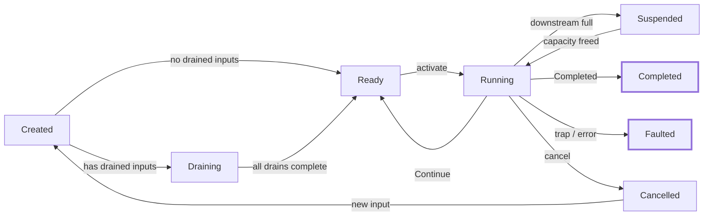

# witgraph
Easy and modular flow based composer

Graphs are built from WASM components whose public contracts are described in
[WIT](https://component-model.bytecodealliance.org/design/wit.html). WIT is the
source of truth: the typed graph IR, validation rules, and editor metadata are
all derived from it.

## Crates

- `witgraph-ir` — the typed graph IR: payload types, port kinds, component
  contracts, graph + builder, validation, topology analysis, and the runtime
  value type (`Val`). Nodes carry compile-time `config` (initial values for
  Value inputs) and fractional `ResourceClaim`s on named shared pools.
  Compilation computes a longest-path `depth_map` used by the runtime
  scheduler to group independent nodes for concurrent execution. Kept light
  on dependencies (`serde` is an on-by-default feature) with future embedded
  targets in mind.
- `witgraph-wit` — loads `.wit` sources with `wit-parser`, lowers component
  worlds into IR contracts, computes content-hash identities, and generates
  the editor-facing metadata catalog.
- `witgraph-runtime` — event-driven WASM execution engine. Extends the
  typestate chain with `RuntimeGraph`, which loads a `CompiledGraph` together
  with WASM component bytes and executes it reactively via wasmtime. Nodes
  run concurrently; channels (value, event, stream, future) carry data between
  them. Ships with `Release` and `Debug` runtime modes (the latter emitting
  trace events).

## The `node` component convention

A witgraph component is a WIT **world** that exports an interface named
`node`. Ports are declared structurally through up to five well-known records
(at least one must be present); the world's **imported functions and
function-carrying interfaces are its capabilities** (type-only imports are
structural, not capabilities). A named interface's capability is its full id
(`namespace:name/interface@version`); an anonymous inline interface is scoped
to the importing world (`namespace:name/world.import-name@version`); bare
function imports are prefixed `func:`.

| Record           | Direction | Port kind | Field type meaning                          |
|------------------|-----------|-----------|---------------------------------------------|
| `inputs`         | input     | see below | `T` → Value; top-level `option<T>` → optional Value; `stream<T>` → Stream; `future<T>` → Future |
| `outputs`        | output    | see below | same mapping (no optional unwrapping)       |
| `input-events`   | input     | Event     | field type is the event payload directly    |
| `output-events`  | output    | Event     | field type is the event payload directly    |
| `drained-inputs` | input     | Stream/Future only | `stream<T>`/`future<T>` consumed to completion before the node's first activation, latched as the total |

The four port kinds:

- **Value** — latched, last-write-wins; read synchronously each iteration.
- **Event** — discrete occurrences, delivered asynchronously.
- **Stream** — ordered, back-pressured sequence.
- **Future** — one-shot asynchronous value.

```wit
package demo:graph@0.1.0;

world sensor {
    import demo:caps/clock@0.1.0;      // capability

    export node: interface {
        record reading { value: f64, timestamp: u64 }

        record inputs {
            sample-rate: option<u32>,  // optional Value input
        }
        record outputs {
            latest: reading,           // Value output
            samples: stream<reading>,  // Stream output
        }
        record output-events {
            threshold-crossed: f64,    // Event output (payload f64)
        }
    }
}
```

### Sync/async node coloring

A node's consumption mode is derived from its input ports, with one
exception-free rule: **any undrained Stream, Event, or Future input colors the
node async** — it fires per async activation, and its Value inputs act as
latched parameters sampled at each firing. A node with no undrained async
inputs is **sync**. Mixing kinds is legal. Outputs are unconstrained.

A **drained input** (declared in the `drained-inputs` record) is consumed to
completion — end-of-stream for a Stream, resolution for a Future — before the
node's first activation, then delivered once as a latched total. A node whose
async inputs are all drained is sync: it fires once with the drained totals.
Mixed drained + reactive inputs are legal too — the node activates only after
every drain completes, then fires per reactive activation.

Draining is per-port, part of the contract (and its content hash), and carries
two restrictions:

- **Stream and Future fields only** (enforced at lowering) — Values and Events
  have no completion semantics, so there is nothing to drain.
- **Drained connections stay off cycles** (enforced at graph compilation) — a
  connection feeding a drained input from within a cycle (feedback included)
  would deadlock waiting on its own downstream. Reactive ports on the same
  node may still close a loop.

### Connections, feedback, and compilation

Connections are legal only when port kinds are equal and payload types are
structurally equal — no coercion. Each input port accepts at most one writer;
outputs fan out freely. Cycles are legal only if every cycle crosses at least
one connection marked `feedback` (a unit-delay state boundary carrying the
previous iteration's value).

Compilation follows a typestate chain: `GraphBuilder → Graph → CompiledGraph → RuntimeGraph`.
Only `Graph` is serializable; `Graph::compile(self)` validates the graph,
collecting every diagnostic rather than stopping at the first, and promotes to
`CompiledGraph`,
which exposes the topological order and aggregated capability requirements.

### Component identity

A component is identified by `namespace:name/world@version` plus a sha-256
content hash of its lowered contract. The hash is purely structural: it covers
the sorted ports and capabilities only — not the package, world, version, doc
comments, or type names — so any two contracts with the same shape hash
identically, and drained inputs are encoded with a distinct label so undrained
contracts keep their hashes. The canonical encoding carries its own version
line, so a deliberate format change shifts hashes explicitly.

## Runtime

The `witgraph-runtime` crate extends the typestate chain with `RuntimeGraph`:
it loads a `CompiledGraph` together with WASM component bytes and executes the
graph reactively via wasmtime.

### The `graph-node` WIT world

Every node component targets the `witgraph:runtime/graph-node` world. It
imports the `runtime-host` interface (the host-side API the node calls during
activation) and exports the `node` interface (the lifecycle the runtime
drives).

**Host imports** (`runtime-host`):

| Function         | Purpose                                        |
|------------------|------------------------------------------------|
| `read-value`     | Read a latched Value input (returns `option<list<u8>>`) |
| `write-value`    | Write a Value output                           |
| `emit-event`     | Emit a discrete Event                          |
| `push-stream`    | Push an item to a Stream output                |
| `close-stream`   | Close a Stream output (end-of-stream)          |
| `resolve-future` | Resolve a Future output (one-shot)             |
| `fatal`          | Signal a graph-fatal condition; halts the tick  |
| `is-cancelled`   | Check whether the host has requested cancellation |

Port data crosses the WASM boundary as `list<u8>` — `serde_json` by default,
or the compact `postcard` format with the `compact-encoding` feature.

**Node exports** (`node`):

| Function   | When called                                          |
|------------|------------------------------------------------------|
| `init`     | Once before any activations (including the drain phase) |
| `activate` | Each activation, with an `activation-kind` reason    |
| `dispose`  | On completion, fault, cancellation, or graph shutdown |

The `activation-kind` variant tells the node why it was activated: `sync`
(Value-only inputs changed), `drain-item` (a drained stream/future delivered
an item), `stream-item`, `event`, `future-resolved`, or `stream-closed`.

### Node lifecycle

Each node follows a phase state machine:



- **Created** — allocated, not yet initialized.
- **Draining** — consuming drained inputs to completion before the first
  reactive activation.
- **Ready** — waiting for an activation trigger.
- **Running** — inside `activate()`.
- **Suspended** — blocked on a full downstream channel (backpressure).
- **Completed** / **Faulted** — terminal.
- **Cancelled** — disposed by the host; restarts (fresh WASM instance, back
  to Created) if new input arrives.

### Scheduler

`RuntimeGraph::tick()` runs one scheduler round:

1. **Route** pending events (external injects, channel writes) to their
   target channels and mark affected nodes activatable.
2. **Actor loop** — pop ready nodes in topological order:
   - Acquire resource claims (defer if the budget is exceeded).
   - Call `init()` on first activation.
   - Build an `InputSnapshot` (connected channels → runtime overrides →
     compile-time config defaults), derive the `activation-kind`, and call
     the node's `activate()` export.
   - Commit output writes to downstream channels; enqueue downstream nodes.
3. **Feedback latch** — at quiescence, flush all buffered feedback-edge
   writes into their target channels and return `Progress` so the caller
   drives the next iteration.

The tick returns `Completed` when all nodes are terminal, `Idle` when no work
was available, `StepLimitReached` when the safety limit fires, or `Aborted`
on a fatal fault.

### Backpressure

Event queues and stream channels are bounded (configurable via
`RuntimeConfig::channel_capacity`). When a downstream channel is full, the
producing node's uncommitted writes are saved and it transitions to
`Suspended`. When the consumer frees capacity, the producer resumes
automatically — the saved writes are retried without re-executing the WASM
activation.

### Resource scheduling

Nodes declare fractional claims on named shared resource pools (e.g. GPU
compute, VRAM). Each pool has an implicit capacity of 1.0. The scheduler
defers activation when the sum of active claims on any pool would exceed
capacity. Claims can be marked `hold` to retain the allocation through
suspension (e.g. VRAM that must not be evicted), or auto-released when the
WASM activation finishes.

### Runtime modes

`RuntimeGraph<M>` is generic over a `RuntimeMode`:

- **`Release`** — all callbacks are empty, monomorphized away to zero cost.
- **`Debug`** — records `TraceEvent`s (before/after activate, channel writes,
  phase transitions, faults, cancellations, restarts) behind a mutex for
  post-mortem inspection.

### Sandboxing

The engine supports wasmtime fuel metering and epoch-based interruption,
configured via `RuntimeConfig`:

- **`fuel_per_activation`** — optional fuel budget applied before each WASM
  `activate()` call. The activation traps when the budget is exhausted
  (`NodeFault::FuelExhausted`).
- **`epoch_deadline`** — optional epoch tick deadline. The host calls
  `WasmEngine::increment_epoch()` externally; any store whose deadline has
  been reached traps (`NodeFault::EpochInterrupted`).

The `prepare_activation` API accepts per-activation fuel and epoch values,
so callers that build custom schedulers can set per-node budgets.
